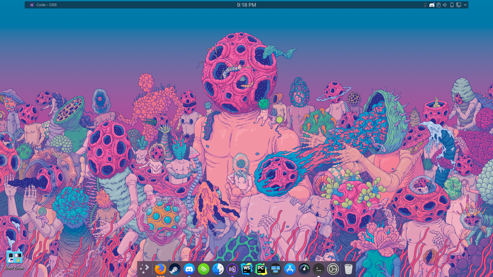
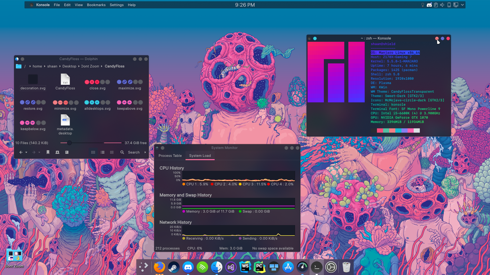
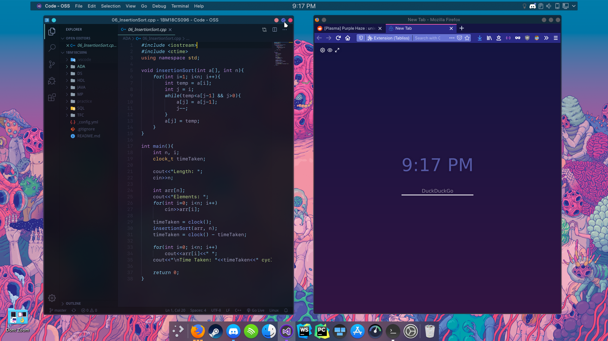

# CandyFloss

CandyFloss is based on [Sweet by EliverLara](https://github.com/EliverLara/Sweet), modified with pastel colors to match the wallpaper. Still WIP

Check `how_to_install` in each directory for installation steps.

## Other Stuff 

* **Wallpaper**: [Womb - Sangho Bang](https://mir-s3-cdn-cf.behance.net/project_modules/fs/7c15f858854195.5a0bec48d4eb8.png)
* **Plasma** [Sweet](https://store.kde.org/p/1294174)
* **Kvantum + Window Decorations + Konsole**: [CandyFloss](https://github.com/shaansubbaiah/CandyFloss)
* **Icons**: [McMojave Circle](https://store.kde.org/p/1305429)
* **Dock + Panel**: [latte-dock-git](https://github.com/KDE/latte-dock)
* **Other**:
   * VSCode with 'Material - Ocean' Theme
   * Konsole with Oh-My-Zsh, Powerline 10K
   * Dock open applications widget/theme: Dash To Panel

## Screenshots
Wallpaper

Konsole, Dolphin, KSysConfig

VSCode, Firefox

